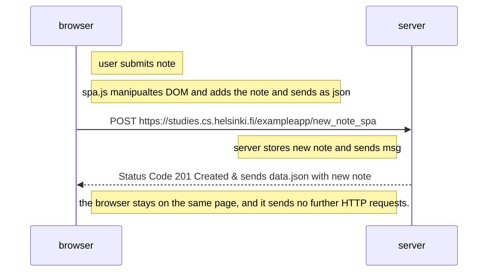

```mermaid
sequenceDiagram
 Note right of browser: user submits note
  Note right of browser: spa.js manipualtes DOM and adds the note and sends as json
    browser->>server: POST https://studies.cs.helsinki.fi/exampleapp/new_note_spa
    Note left of server: server stores new note and sends msg
    server-->>browser: Status Code 201 Created & sends data.json with new note
    Note right of browser: the browser stays on the same page, and it sends no further HTTP requests.

```
