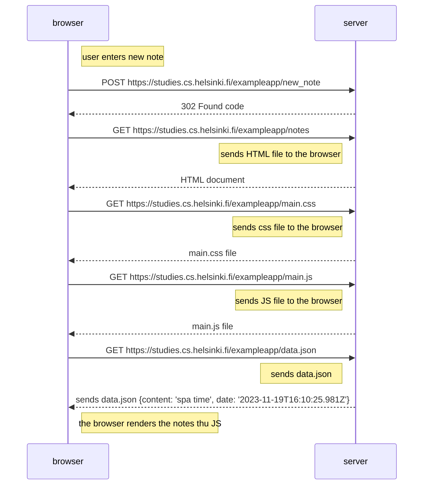

```mermaid
sequenceDiagram
 Note right of browser: user enters new note
    browser->>server: POST https://studies.cs.helsinki.fi/exampleapp/new_note
    server-->>browser: 302 Found code
    browser->>server: GET https://studies.cs.helsinki.fi/exampleapp/notes
    Note left of server: sends HTML file to the browser
    server-->>browser: HTML document
    browser->>server: GET https://studies.cs.helsinki.fi/exampleapp/main.css
     Note left of server: sends css file to the browser
    server-->>browser: main.css file
    browser->>server: GET https://studies.cs.helsinki.fi/exampleapp/main.js
    Note left of server: sends JS file to the browser
    server-->>browser: main.js file 
    browser->>server: GET https://studies.cs.helsinki.fi/exampleapp/data.json
    Note left of server: sends data.json
    server-->>browser: sends data.json {content: 'spa time', date: '2023-11-19T16:10:25.981Z'}
    Note right of browser: the browser renders the notes thu JS 

```
