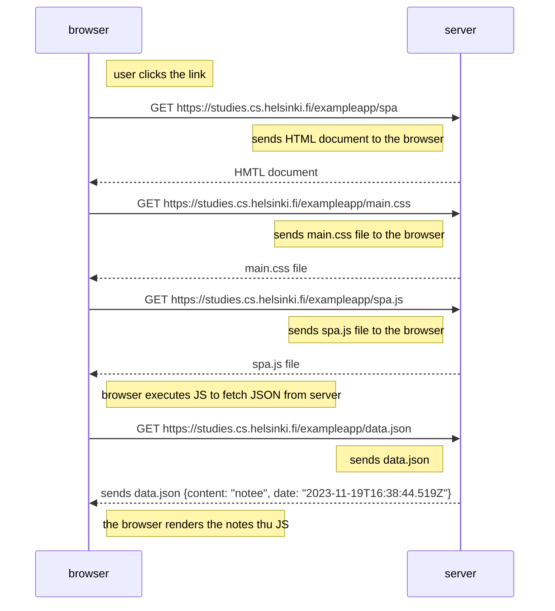

```mermaid
sequenceDiagram
 Note right of browser: user clicks the link
    browser->>server: GET https://studies.cs.helsinki.fi/exampleapp/spa
    Note left of server: sends HTML document to the browser
    server-->>browser: HMTL document
    browser->>server: GET https://studies.cs.helsinki.fi/exampleapp/main.css
    Note left of server: sends main.css file to the browser
    server-->>browser: main.css file
    browser->>server: GET https://studies.cs.helsinki.fi/exampleapp/spa.js
     Note left of server: sends spa.js file to the browser
    server-->>browser: spa.js file
     Note right of browser: browser executes JS to fetch JSON from server
    browser->>server: GET https://studies.cs.helsinki.fi/exampleapp/data.json
    Note left of server: sends data.json
    server-->>browser: sends data.json {content: "notee", date: "2023-11-19T16:38:44.519Z"}
    Note right of browser: the browser renders the notes thu JS 

```
